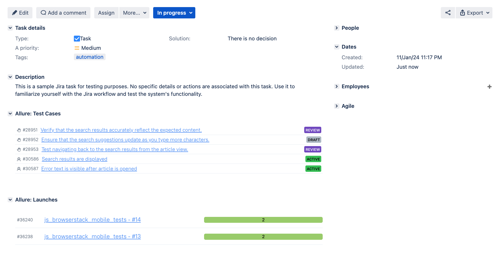

# Atomated testing of the [Wikipedia's](https://www.wikipedia.org/) mobile application via [Browswerstack](https://www.browserstack.com/)


## Content

- <a href="#tools"> Tools</a>
- <a href="#cases"> Test Cases</a>
- <a href="#autotests"> Running Automated Tests</a>
- <a href="#jenkins"> Jenkins Build</a>
- <a href="#allureReport"> Example of Allure Report</a>
- <a href="#allure"> Integration with Allure TestOps</a>
- <a href="#jira"> Integration with Jira</a>
- <a href="#telegram"> Telegram notifications</a>
- <a href="#video"> Example of test execution via Browserstack</a>

____
<a id="tools"></a>
## Tools

<p align="center">
<a href="https://www.java.com/"></a>
<a href="https://selenide.org/"></a>
<a href="https://browserstack.com/"></a>
<a href="https://github.com/allure-framework/allure2"></a>
<a href="https://qameta.io/"></a>
<a href="https://gradle.org/"></a>
<a href="https://junit.org/junit5/"></a>
<a href="https://www.jenkins.io/"></a>
<a href="https://web.telegram.org/"></a>
<a href="https://www.atlassian.com/ru/software/jira/"></a>
</p>

____
Tests are written in Java using the Appium framework for mobile automation testing, and the build tool is Gradle.
JUnit 5 is employed as the framework for unit testing. When running tests for remote execution, Browserstack is utilized.
For remote execution, a Jenkins job is implemented with the generation of an Allure report and sending the results to Telegram via a bot.
Integration with Allure TestOps and Jira is also implemented.

The contents of the Allure report for each test case include:
- Test steps and the results of their execution
- Screenshot of the page at the last step (to visually analyze why the test failed)
- Page Source (ability to open the page source in a new tab and see the reason for the test failure)
- Browser console logs
- Video (Screen recording from the Browserstack) of the test automation execution.

____
<a id="cases"></a>
## :male_detective: Test Cases

Automated:
- Verification of search results detection
- Searching for the required definition
- Verification of headline presence in news

Manual:
- Verification of successful navigation to the body of the news via link

<a id="autotests"></a>
____
## :arrow_forward: Running Automated Tests

### Running Tests from the Terminal

#### Execution from the project's root directory:

<em> To run <b>all</b> the tests: </em>

```
gradle clean test 
```

____
<a id="jenkins"></a>
##  </a> Jenkins Build <a target="_blank"> </a>

Registration on the [Jenkins](https://jenkins.autotests.cloud/) resource is required for access to Jenkins.

To start the build, go to the "Build with parameters" section, select the necessary parameters, and click "Build".
### Jenkins Build Parameters:
- TASK (set of tests to run)
- BROWSER (browser, chrome by default)
- RESOLUTION (browser window size, 1920x1080 by default)
- VERSION (browser version, 100.0 by default. Supports execution in Firefox on versions 98.0 and 97.0, as well as Chrome 99.0 and 100.0)
- BASE (tested site base url)

<p align="center">

</p>
After the build is completed, icons for "Allure Report" and "Allure TestOps" will appear next to the build number in the "Build History" section. Clicking on these icons opens pages with the generated HTML report and test documentation, respectively.

____
<a id="allureReport"></a>
##  </a> Example of <a target="_blank" href="https://jenkins.autotests.cloud/job/bob_autotests/20/"> Allure Report </a>

<p align="center">

</p>

____
<a id="allure"></a>
##  </a> Integration with <a target="_blank" href="https://allure.autotests.cloud/project/3952/dashboards"> Allure TestOps </a>

On the *Dashboard* in **Allure TestOps**, you can see the statistics of the number of tests: how many of them are added and executed manually, how many are automated. New tests and test run results are sent through the integration with each build.

<p align="center">

</p>

____
<a id="jira"></a>
##  </a> Integration with <a target="_blank" href="https://jira.autotests.cloud/browse/HOMEWORK-1042"> Jira </a>

Integration with **Allure TestOps** and **Jira** is implemented. In the Jira task, you can see which test cases were written as part of the task and their execution results.

<p align="center">

</p>

____
<a id="telegram"></a>
##  Telegram notifications via bot

After the build is complete, a **Telegram** bot automatically processes and sends a message with the test run report to a specifically configured chat.

<p align="left">

</p>

____
<a id="video"></a>
##  </a> Browserstack video attachment example

In the Allure reports for each test, a video of the test execution is attached along with a screenshot.

<p align="center">
  
</p>
